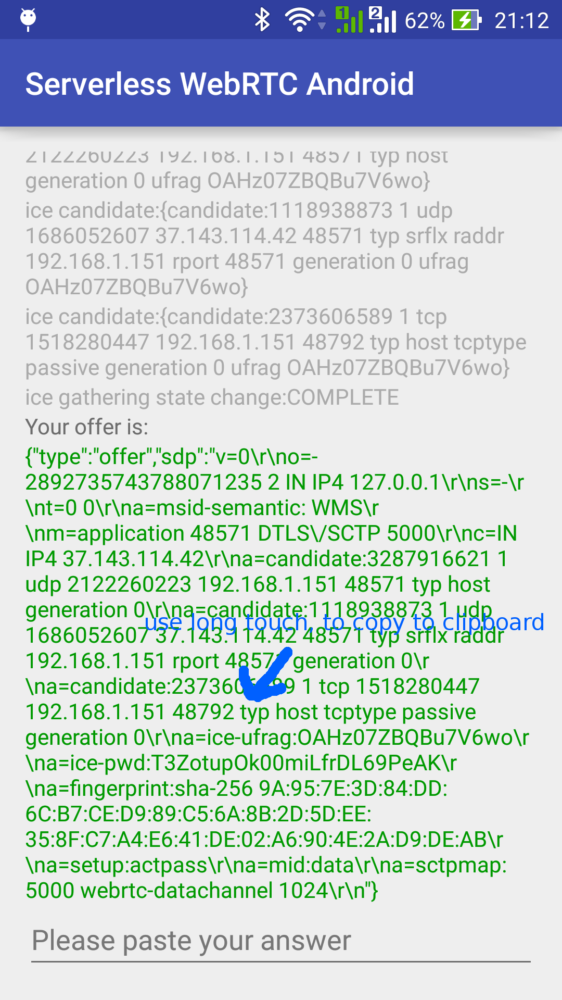
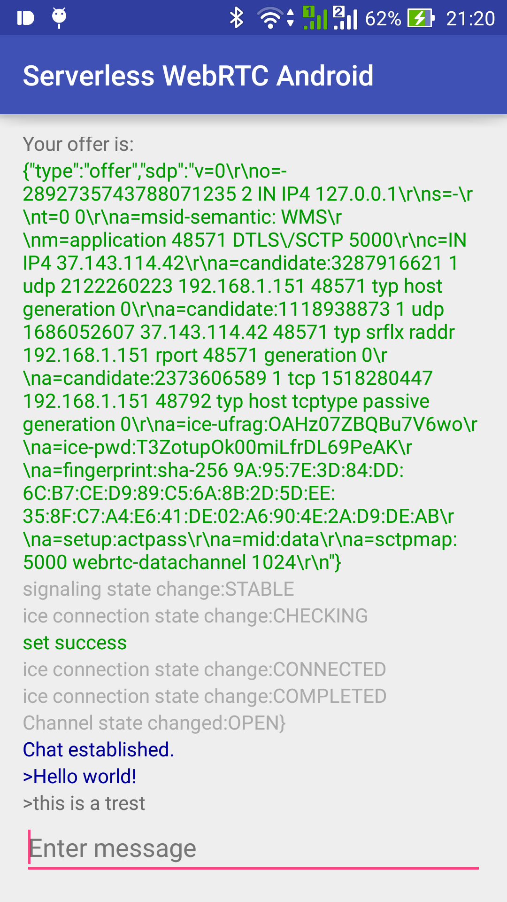

# serverless-webrtc-android

A demo of using WebRTC with no signaling server. But for Android written in Kotlin.

Compatible and inspired by this project written for JavaScript by Chris Ball:
* http://blog.printf.net/articles/2013/05/17/webrtc-without-a-signaling-server/
* http://blog.printf.net/articles/2014/07/01/serverless-webrtc-continued
* https://cjb.github.io/serverless-webrtc/serverless-webrtc.html

# What is WebRTC?

It's technology for real time peer to peer comunication. Especially useful for transfering audio and video - teleconference apps, but can be used for ordinary data as in this example.
WebRTC is supported in recent Chrome browser, Node.js and also on Android/iOS.

# How it works?
WebRTC requires two data payloads to be transferred between parties, it's called [*SDP*](https://en.wikipedia.org/wiki/Session_Description_Protocol) (sesssion description protocol). One is called *offer* and the second is *answer*.

You can either create an offer and send it to other party or wait for an offer to be delivered to you.
Usually SDP handshakes are done by special signalling server, but in this case we are not using any, so you'll need to pass SDPs manually by e.g. e-mail.

If it's running IPv4, it's very unlikely that both parties will have a public IP address or it will be on the same network.
SDP requires that you'll need to pass external IP address there, this is done automatically by process called ICE gathering. It uses two types of external servers - [STUN](https://en.wikipedia.org/wiki/STUN) and [TURN](https://en.wikipedia.org/wiki/Traversal_Using_Relays_around_NAT).
We are using only STUN here, but it should work with TURN as well (and even better).
It can even punch through some NAT mechanisms.

It uses **libjingle** library, it's a native library for WebRTC that comes with [Chromium](https://www.chromium.org/). There is also JNI wrapper for use in Java. You can compile it by yourself but it's extremely tricky. You can use already build dependency in your `build.gradle`. This helped me a lot:
* http://tech.pristine.io/automated-webrtc-building/
* https://github.com/pristineio/webrtc-build-scripts

# Usage
  

# Known issues
* There is no renegotiation of connection, it doesn't make much sense without signalling server.
* If you paste offer in the app, answer is created but after while it goes with 'icegathering failed'. You must be fast to pass the answer to the other side. I'm not sure what causes this.

# License
You can do whatever you want with this code.

